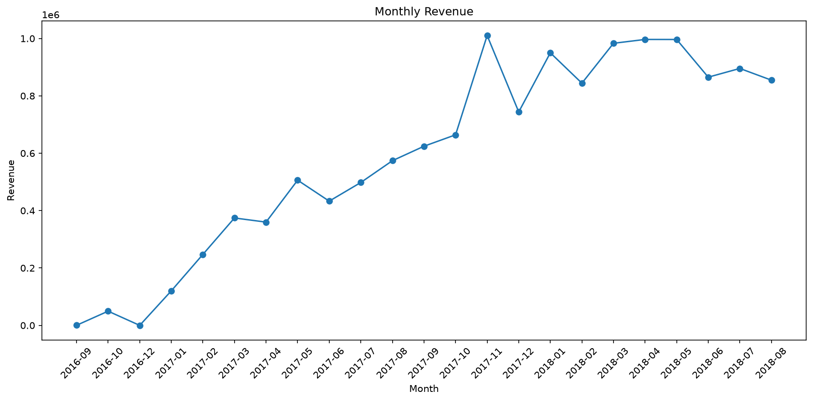
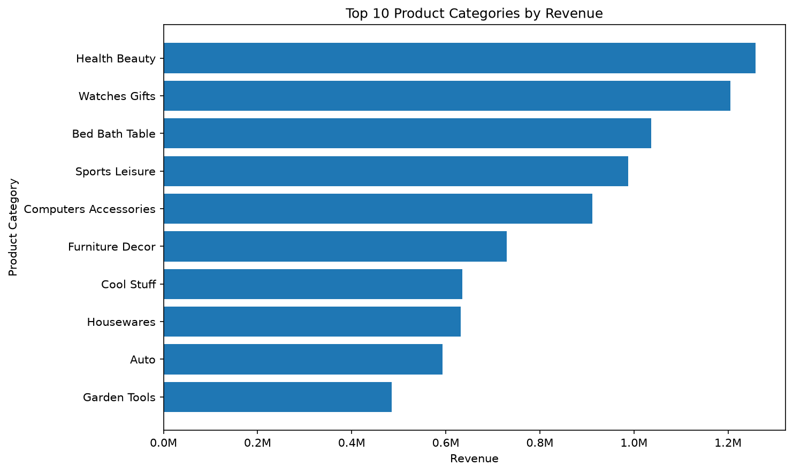
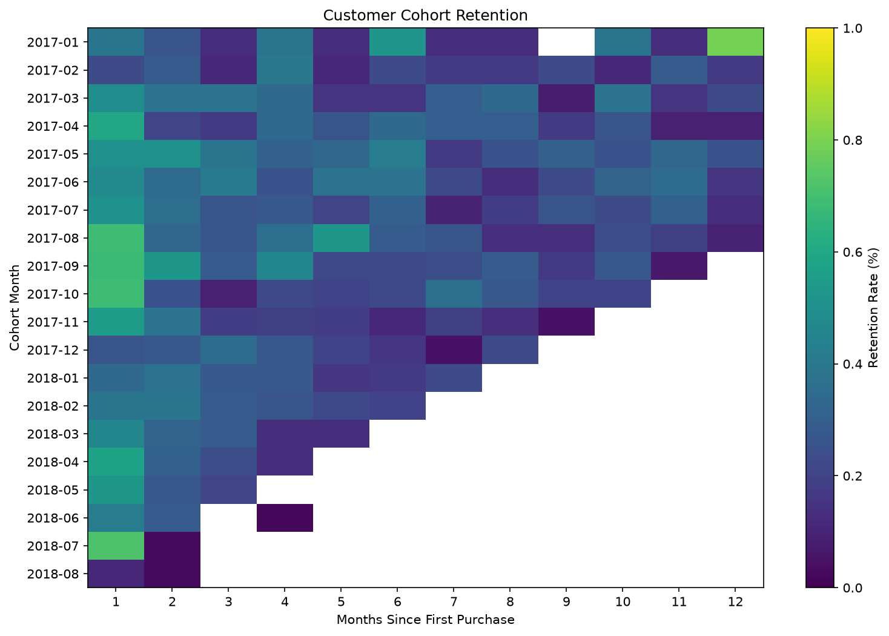

# Customer Sales Analytics

End-to-end analytics project using Python, DuckDB and SQL to analze e-commerce sales, customer behavior and retention.

## Project Overview

This project analyses the Olist Brazilian E-Commerce dataset.

The goal is to transform raw transactional data into meaningful business insights using:

- Python
- pandas
- DuckDB
- SQL
- matplotlib
- Git/GitHub

The analysis focuses on sales performance, product categories, customer behavior, and customer retention.

## Dataset

The dataset comprises approximately 100,000 e-commerce orders and includes information about:
- customers
- orders
- products
- sellers
- payments
- reviews
- geolocation
- product category translations
- more.

Raw data is not included in this repository.

## Data Pipeline

``` text
RAW CSV files
     ↓
Data inspection
     ↓
DuckDB database
     ↓
Data quality checks
     ↓
SQL analysis
     ↓
Python visalizations
```

## Data Quality
Before running the analysis, the dataset is validated using a set of automated data-quality checks.

The checks verify referential integrity between the main tables and identify invalid values including negative product prices, negative freight values, invalid review scores and implausible purchase or delivery dates.

The validation logic is implemented in `src/run_quality_checks.py`

## Key Metrics

The dataset contains around 99,400 orders with approximately 13.6 million in product revenue.

The average product value per order is around 137.75, while the average delivery time is around 12.5 days.

These metrics provide a high-level overview of the dataset moving into more detailed sales and customer analyses.

## Monthly Revenue

Monthly revenue increased substantially throughout 2017 and remained at a relatively high level during most of 2018.



The final partial month in the dataset is excluded from the interpretation as it does not represent a complete month of transactions.

## Top Products Categories

Revenue is concentrated in a relatively small number of product categories.

The highest-revenue categories include Health Beauty, Watches Gifts, Bed Bath Table, Sports Leisure and Computer Accessories.



This analysis helps identify which product groups contribute most strongly to the total sales.

## Customer Retention

Customer retention is analysed using monthly cohorts based on each customer's first purchase.

 

Retention after the initial purchase is consistently low across most cohorts. Most monthly retention rates remain below 1%.

The visualisation focuses on the first 12 months after the initial purchase in order to make the cohorts easier to compare.

## SQL Techniques Used

The analysis uses several intermediate and advanced SQL techniques.

These include joins, aggregations, common table expressions, window functions, 'LAG', 'DENSE_RANK', conditional aggregation with 'FILTER' and date calculations.

## Running the Project

To locally run the project, first install the required Python dependencies (if not done before):
```bash
pip install -r requirements.txt
```

The raw CSV files should be placed in `data/raw/`.

Afterwards, load the data into the DuckDB database:
```bash
python src/load_duckdb.py
```

Run the automated data-quality checks:
```bash
python src/run_quality_checks.py
```

The basic and advanced SQL analyses can be executed with:
```bash
python src/run_analysis.py basic
python src/run_analysis.py advanced
```

The visualizations can be generated separately:
```bash
python src/plot_monthly_revenue.py
python src/plot_top_categories.py
python src/plot_cohort_retention.py
```

## Future Improvements
- RFM customer segmentation
- Geographic sales analysis
- Delivery-delay analysis by region
- revenue forecasting
- interactive BI dashboard

